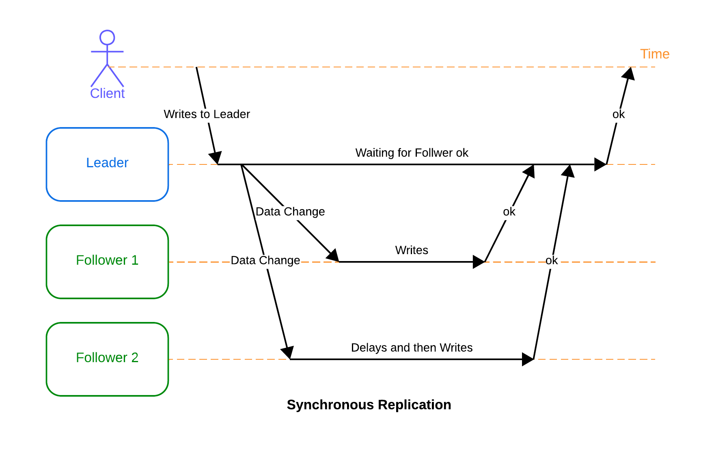
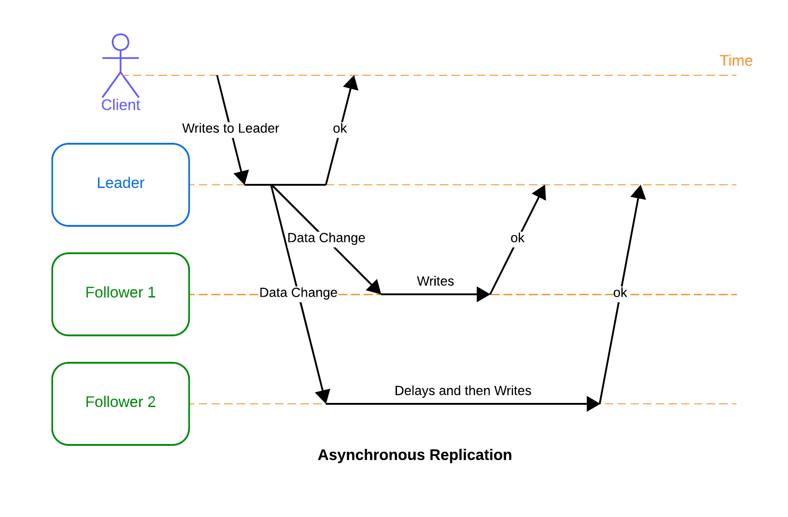

# **Go Leader-Follower Replication**

This project is a simple, in-memory key-value store written in Go that demonstrates a basic leader-follower replication model. It supports both synchronous and asynchronous replication and allows for simulating network partitions for testing purposes.

## **Features**

* **Leader-Follower Replication**: One node acts as the leader, accepting all writes. Other nodes act as followers, receiving replicated writes from the leader.  
* **Replication Modes**:  
  * **Synchronous (sync)**: The leader waits for all followers to acknowledge a write before responding to the client, ensuring stronger consistency.  
  * **Asynchronous (async)**: The leader responds to the client immediately and replicates to followers in the background, offering lower latency.  
* **Conflict Resolution**: Uses **Last Write Wins (LWW)** based on UTC timestamps. If two writes for the same key occur, the one with the later timestamp is accepted.  
* **HTTP API**: A simple RESTful API for writing (`/put`), reading (`/get`), and checking node status (`/status`).  
* **Partition Simulation**: Includes an admin endpoint (`/partition`) to dynamically block and unblock communication to followers, making it easy to test behavior during network partitions.

## **Prerequisites**

To run this project, you will need:

* [Go](https://go.dev/doc/install) (version `1.23` or later)  
* [Docker](https://docs.docker.com/get-docker/)  
* [Docker Compose](https://docs.docker.com/compose/install/)

## **Project Structure**
```bash
.  
├── cmd/server/main.go       # Entrypoint, flag parsing, server setup  
├── internal/  
│   ├── api/http.go          # All HTTP handlers and routing  
│   ├── cluster/node.go      # Structs for NodeConfig, Role, Mode  
│   ├── repl/repl.go         # Replication client logic  
│   └── store/store.go       # Thread-safe in-memory KV store  
├── Dockerfile               # Multi-stage Docker build  
├── docker-compose.yml       # 3-node cluster definition  
└── go.mod  
```

## **Architecture & Data Flow**
#### Synchronous Replication
In synchronous replication, the leader does not consider a write operation successful until all the followers have confirmed that it has received and applied the change. This means that the data is guaranteed to be available on all the followers as soon as the leader acknowledges the write, ensuring that all replicas are consistent at that moment.


#### Asynchronous Replication
In contrast, asynchronous replication allows the leader to write data and immediately confirm the write to the client without waiting for the followers to process the data. The leader sends the changes to the followers, but it does not wait for an acknowledgment. The followers eventually receive the data and update their copies, but there may be a delay between the time the leader writes the data and the time the follower applies it.


## **API Endpoints**

#### **Client API**

* **POST /put**: Write a key-value pair (Leader only).  
  * Body: `{"key": "my-key", "value": "my-value"}`  
* **GET /get**: Read a key (Leader or Follower).  
  * Query: `?key=my-key`

#### **Internal Cluster API**

* **POST /replicate**: Used by the leader to send writes to followers (Follower only).

#### **Admin API**

* **GET /status**: Returns the node's ID, role, mode, peers, and all data.  
* **POST /partition**: Simulates a network partition (Leader only).  
  * `?block=http://peer-url`: Block replication to this peer.  
  * `?unblock=http://peer-url`: Unblock replication to this peer.

## **Running the Project with Docker**

The easiest way to run the full 3-node cluster (1 leader, 2 followers) is with Docker Compose.

1. **Build the Docker images**:  
   Open your terminal in the project's root directory and run:  
   ```bash
   docker-compose build
   ```

2. **Start the services**:  
   To start the cluster in detached mode (in the background), run:  
   ```bash
   docker-compose up -d
   ```
   *(To see the logs from all containers in your terminal, run `docker-compose up` without the `-d` flag. This is very useful for watching the demo steps in real-time.)* 

3. **Stop and remove the containers**:  
   When you are finished, stop and clean up the containers:  
   ```bash
   docker-compose down
   ```

## **Demo & How to Use**

All curl commands below should be run from your local terminal. The leader is available on port `8080`, and the two followers are on `8081` and `8082`. Using a tool like `jq` to pretty-print JSON is recommended.

#### **1. Check Node Status**

First, let's verify that all three nodes are running correctly.

**Leader (:8080)**:
```bash
curl http://localhost:8080/status | jq
```

*Expected Output:*
```json
{  
  "id": "leader-1",  
  "role": "leader",  
  "mode": "sync",  
  "port": 8080,  
  "peers": [  
    "http://follower1:8081",  
    "http://follower2:8082"  
  ],  
  "data": {},  
  "blocked": {}  
}
```

**Follower 1 (:8081)**:
```bash
curl http://localhost:8081/status | jq
```

*Expected Output:*
```json
{  
  "id": "follower-1",  
  "role": "follower",  
  "mode": "sync",  
  "port": 8081,  
  "peers": null,  
  "data": {},  
  "blocked": {}  
}
```

#### **2. Write Data (Sync Replication)**

Let's write a key city to the leader. The cluster is in sync mode by default, so this request will only complete after the data is written to both followers.
```bash
curl -X POST -H "Content-Type: application/json" \  
  -d '{"key":"city", "value":"Raleigh"}' \  
  http://localhost:8080/put
```

*Output:*
```json
{"status":"ok","mode":"sync","req_id":"..."}
```

#### **3. Read Data**

The write is now present on the leader and has been synchronously replicated. You can read the value from any node.

**Read from Leader (:8080)**:
```bash
curl "http://localhost:8080/get?key=city" | jq
```

*Output:*
```json
{  
  "key": "city",  
  "value": "Raleigh",  
  "ts": "2025-10-21T01:26:00Z"  
}
```

**Read from Follower 1 (:8081)**:
```bash
curl "http://localhost:8081/get?key=city" | jq
```

The output will be the same as the leader's.

#### **4. Simulate a Network Partition**

Now for the interesting part. Let's tell the leader to "block" all replication attempts to `follower1`.
```bash
curl -X POST "http://localhost:8080/partition?block=http://follower1:8081"
```

Check the leader's status. You'll see the block is active.
```bash
curl http://localhost:8080/status | jq .blocked
```

*Output:*
```json
{  
  "http://follower1:8081": true  
}
```

#### **5. Write During a Partition**

Let's write a new key, weather. Because the leader is in sync mode and cannot reach `follower1`, this request will **hang** until the 5-second HTTP client timeout is reached. After the timeout, the leader gives up on the blocked peer and completes the request.
```bash
curl -X POST -H "Content-Type: application/json" \  
  -d '{"key":"weather", "value":"clear"}' \  
  http://localhost:8080/put
```

**Now, check the data consistency:**

* **Leader (:8080)**: Has the new data.
  ```bash
  curl "http://localhost:8080/get?key=weather" | jq .value  
  ```

* **Follower 2 (:8082)**: Received the replication successfully.  
  ```bash
  curl "http://localhost:8082/get?key=weather" | jq .value  
  ```

* **Follower 1 (:8081)**: **Is now inconsistent.** It never received the write.  
  ```bash
  curl "http://localhost:8081/get?key=weather"
  ```  

#### **6. Heal the Partition**

Let's remove the block to "heal" the partition.
```bash
curl -X POST "http://localhost:8080/partition?unblock=http://follower1:8081"
```

The partition is now healed, but `follower1` is still missing the weather key. This simple model does not have an automatic anti-entropy or catch-up mechanism. However, new writes will succeed.

Let's update the weather key.
```bash
curl -X POST -H "Content-Type: application/json" \  
  -d '{"key":"weather", "value":"rainy"}' \  
  http://localhost:8080/put
```

Now, check `follower1`. It has received the *new* write and is now consistent for this key.
```bash
curl "http://localhost:8081/get?key=weather" | jq .value  
```
